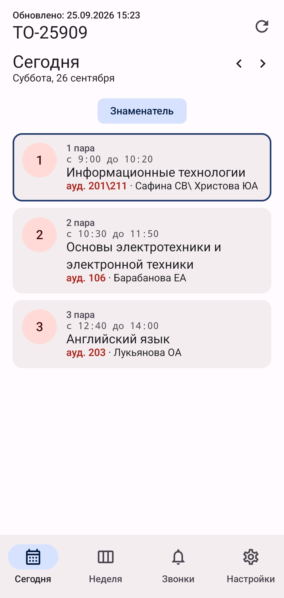
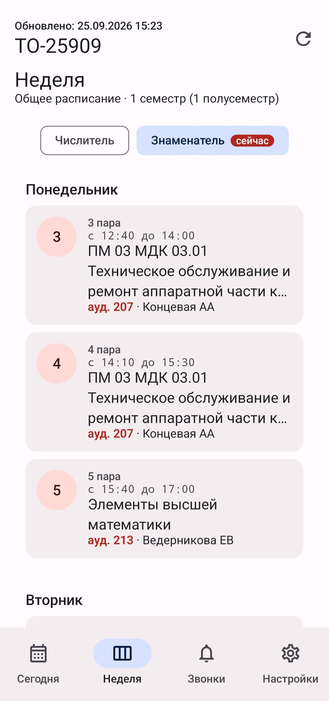
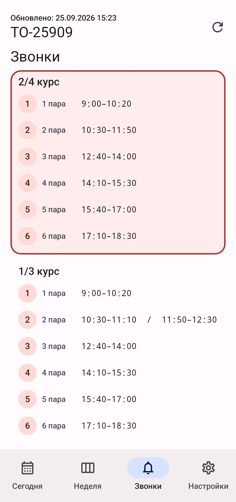
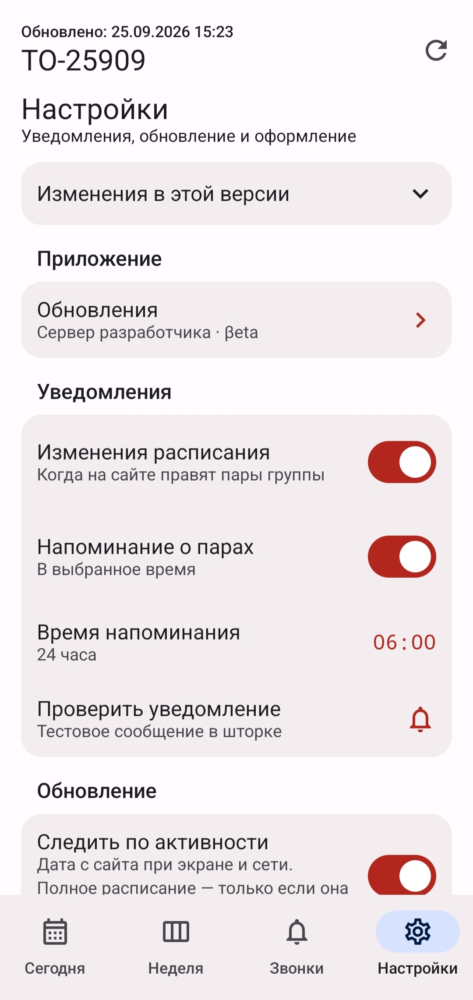
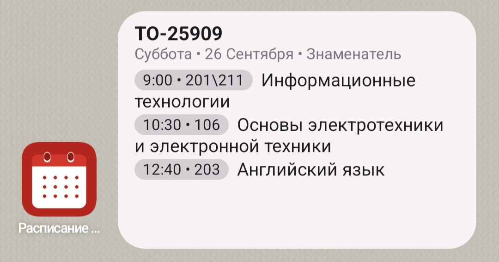
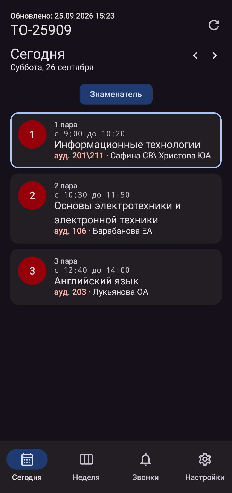
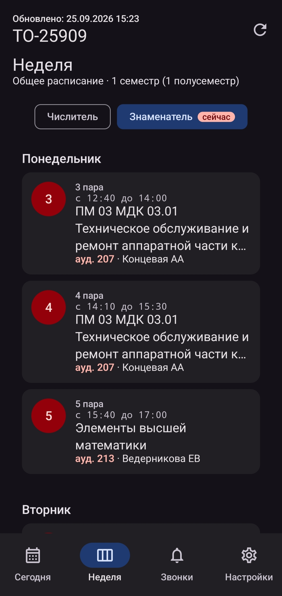
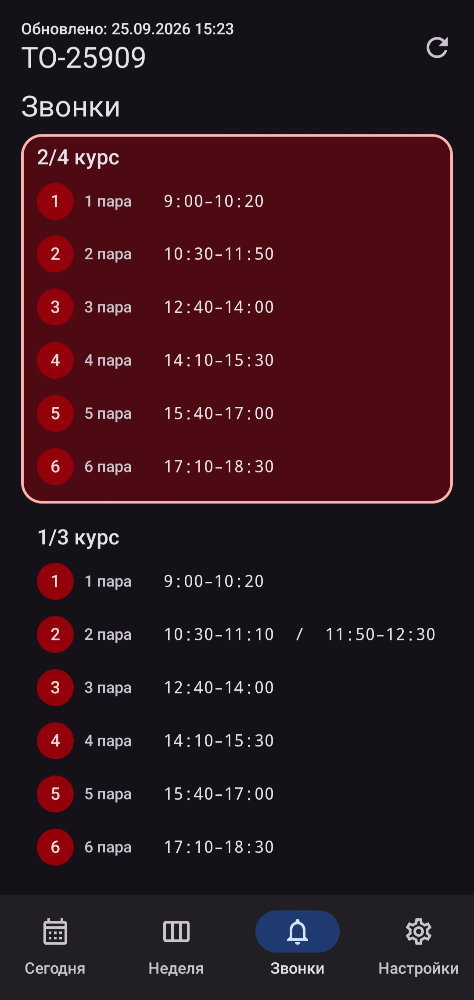
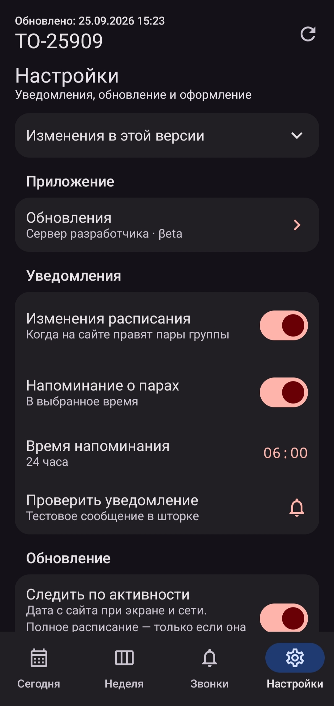
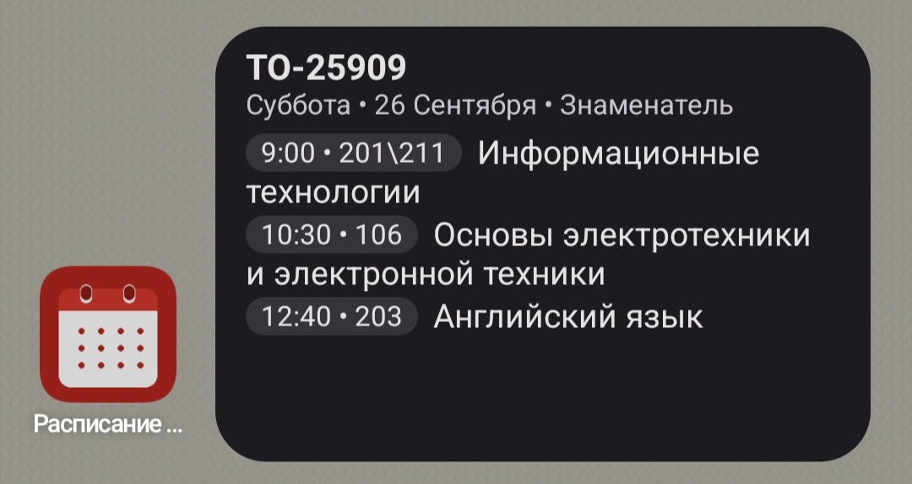

  

<h1 align="center">Расписание НТМТ</h1>

  Неофициальное приложение для Android. Расписание с публичной страницы <a href="https://nti.urfu.ru/schedule-ntmt">nti.urfu.ru/schedule-ntmt</a>. 
  Создано с помощью Grok Build.

  

## Возможности

- Виджет на рабочий стол
- Быстрое переключение на вторую группу
- Последнее расписание остаётся, если нет сети

## Установка

При установке APK Google Play защита может написать, что приложение не проверено. Так помечаются файлы не из магазина. В окне нажмите «Подробнее», затем «Всё равно установить».

После установки рекомендуется разрешить фоновую работу для корректной работы уведомлений.

## Скриншоты

Светлая тема

  
  
  
  
  

Тёмная тема

  
  
  
  
  

## Обновление приложения

Два канала: Stable и βeta. 
Канал βeta имеет нестабильные пакеты с функциями в раннем доступе.
Публикация сборок через панель [Zealot](https://github.com/tryzealot/zealot).

